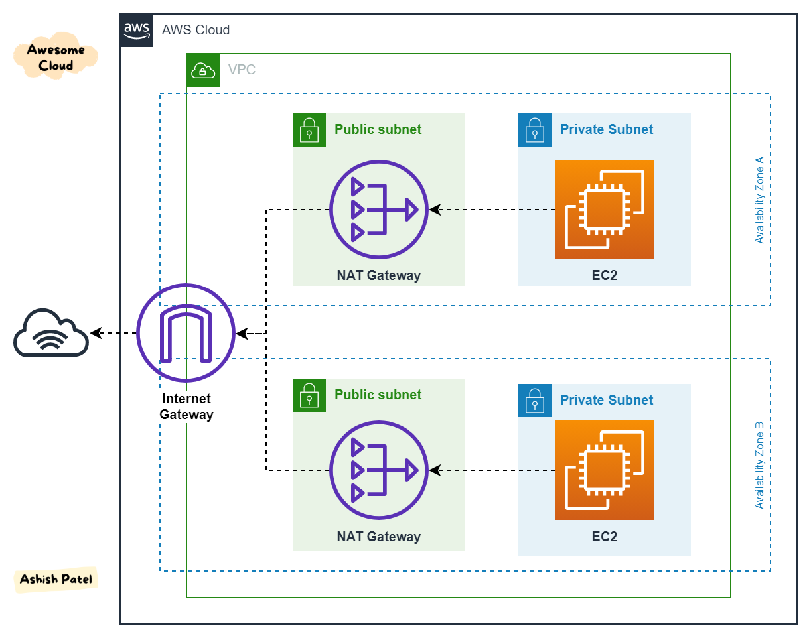
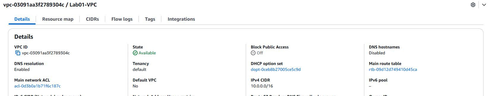
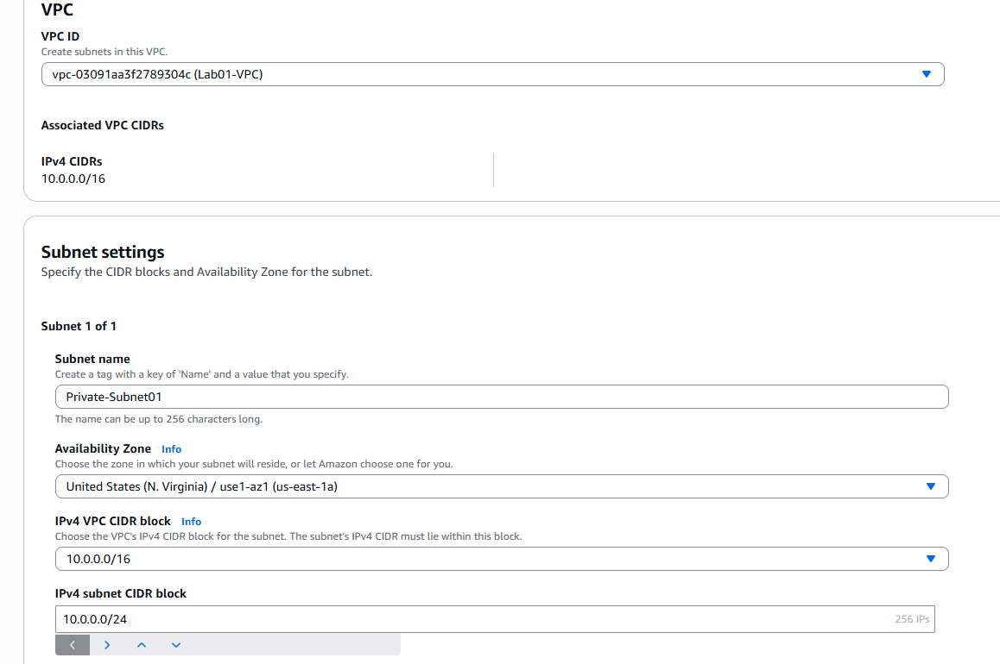
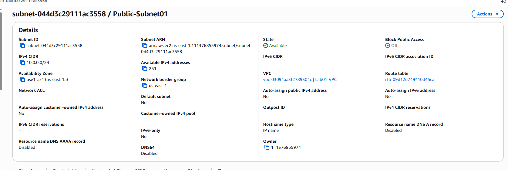
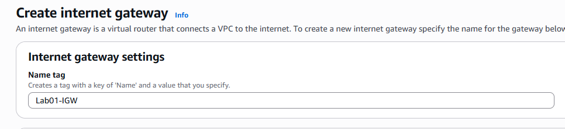
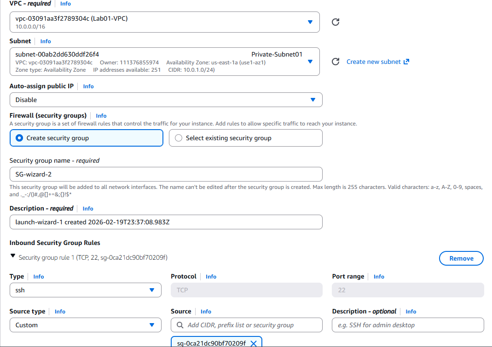
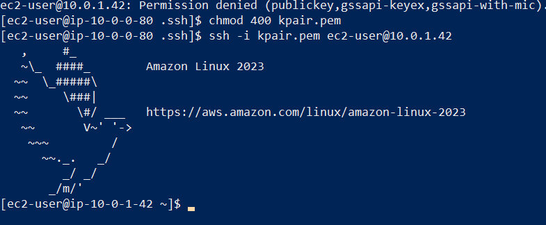

AWS 2-Tier Architecture Lab (Public & Private Subnet)
###  Project Overview

```
                    Internet
                        │
                 Internet Gateway
                        │
              ┌──────────────────┐
              │     Public Subnet │
              │  ───────────────  │
              │  Public EC2       │
              │  NAT Gateway      │
              └──────────────────┘
                        │
                 (via NAT Gateway)
                        │
              ┌──────────────────┐
              │    Private Subnet │
              │  ───────────────  │
              │  Private EC2      │
              └──────────────────┘
              
```




This lab demonstrates how to build a secure 2-tier AWS architecture using a custom VPC. The environment includes a public subnet for internet-facing resources and a private subnet for secure internal instances. The goal was to understand VPC networking, routing, NAT Gateway functionality, and secure SSH access using a bastion host pattern.

🔹 Step-by-Step Walkthrough
1.   ** Created Custom VPC

CIDR block: 10.0.0.0/16


DNS resolution enabled

This provides a large IP range that can be subdivided into smaller subnets.


2.   ** Created Subnets

Public Subnet → 10.0.0.0/24

Private Subnet → 10.0.1.0/24

Each subnet was created in the same Availability Zone for simplicity.
Public subnet was configured to auto-assign public IP addresses.





3.   ** Configured Internet Access
Internet Gateway (IGW)

Created and attached to the VPC

Enables internet access for public subnet resources




Lets add an elastic ip  on your VPC dashboard:
VPC → Elastic IPs → Allocate Elastic IP

Create NAT Gateway
Go to:
VPC → NAT Gateways → Create NAT Gateway
Fill in:
Name: MyLab-NAT
Subnet: Public-Subnet ⚠️ IMPORTANT
Elastic IP: Select the one you just created
Click Create NAT Gateway


4.   ** Security Groups Configuration
Public EC2 Security Group

Inbound:

SSH (22) → My IP only

HTTP (80) → Optional

Outbound:

Allow all

Launching EC2 in the public subnet


Private EC2 Security Group

Inbound:

SSH (22) → Source: Public EC2 Security Group

Outbound:

Allow all

This ensures:

No direct internet access to private EC2

Only bastion host can SSH into private EC2

Launch EC2 in the Private Subnet 


To see if the instance is working we log in through ssh as you can see its only accessible through the public instance .


Testing & Validation

✔ Successfully SSH’d into Public EC2

✔ Successfully SSH’d from Public EC2 to Private EC2

✔ Verified Private EC2 outbound internet access via NAT Gateway using:

```
curl google.com
```

Issue: NAT Gateway Failed Initially

Cause: Public route table not configured correctly.

Solution: Created and associated correct route table pointing to Internet Gateway before recreating NAT Gateway.

Conclusion

This lab successfully implemented a secure AWS 2-tier architecture following industry best practices. It demonstrates the ability to design, deploy, and troubleshoot AWS networking components manually using the AWS Console.

