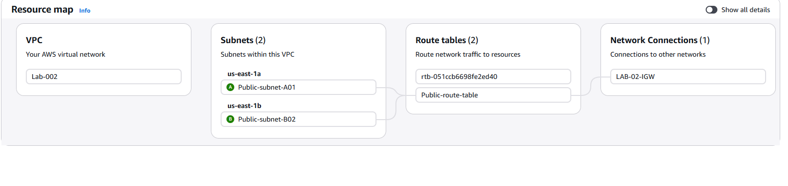
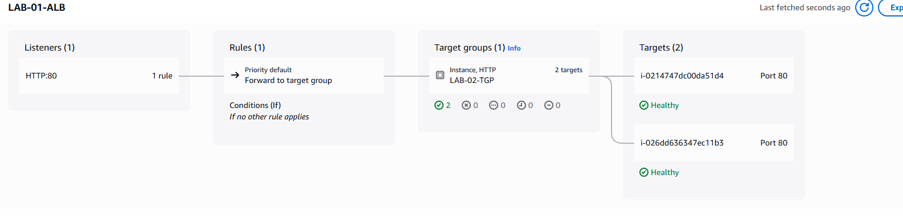
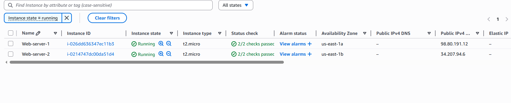
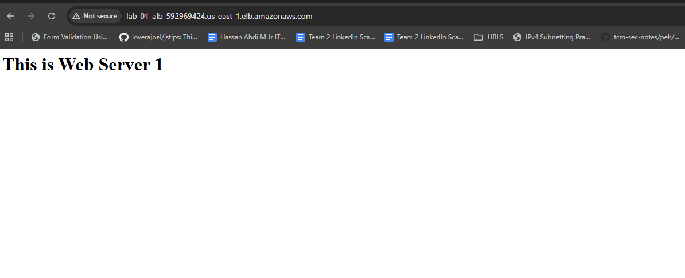
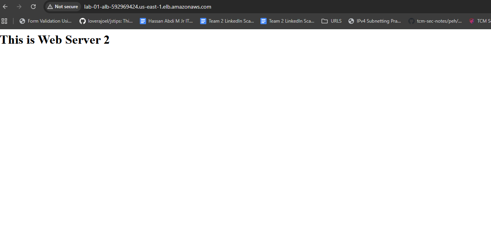
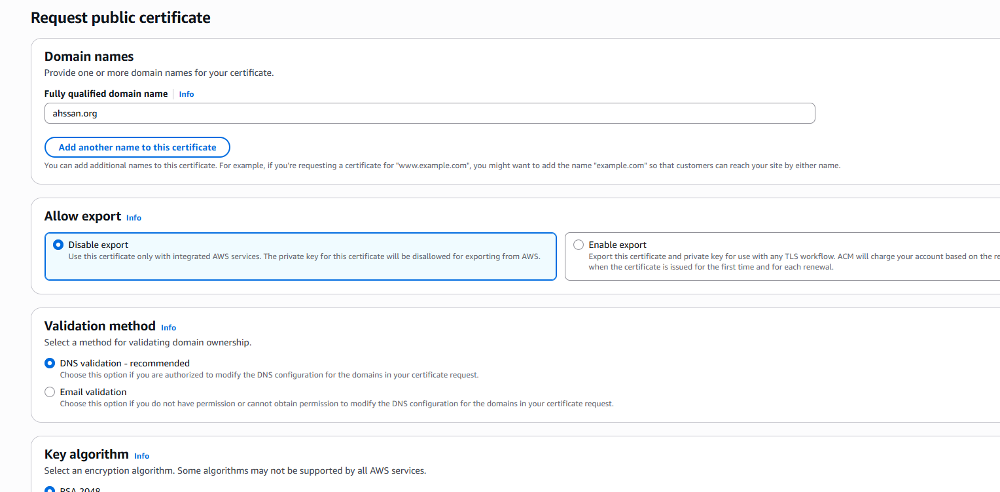
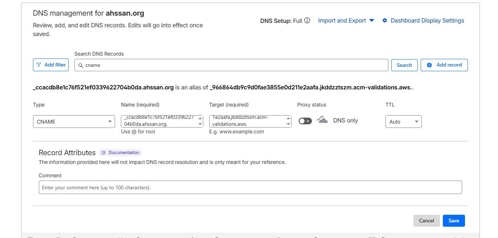
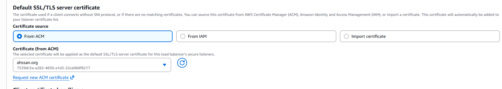
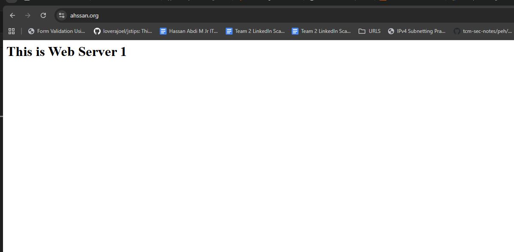

# # Production-Ready AWS Web Architecture
ALB + HTTPS (ACM) +  Cloudflare DNS
Description

This project demonstrates a highly available, secure, and scalable AWS web architecture built from scratch.

The infrastructure uses a custom VPC, multi-AZ deployment, Application Load Balancer, HTTPS via AWS Certificate Manager, Cloudflare DNS integration.

This setup mirrors real-world production DevOps patterns used in modern cloud environments.

## Features

*Multi-AZ deployment for high availability

Application Load Balancer (ALB)

HTTPS secured using AWS Certificate Manager (ACM)

Cloudflare DNS integration

Auto Scaling Group (self-healing infrastructure)

Health checks with automatic target replacement

Secure security group isolation (no direct EC2 exposure)

HTTP → HTTPS automatic redirection*

# **1️⃣ Create VPC & Networking**

This project is deployed entirely in AWS Console (no local app build required).

```
# VPC CIDR
10.0.0.0/16

# Public Subnet 1
10.0.0.0/24

# Public Subnet 2
10.0.1.0/24
```
Create Internet Gateway

Attach to VPC



## 2️⃣ Application Load Balancer
Created an Internet-facing ALB:

Placed in both public subnets

Listener: HTTP (80)

Created Target Group (HTTP, port 80)

Health check path: /

Security Groups: * ALB SG: Allows Ports 80 (HTTP) and 443 (HTTPS) from the world.

EC2 SG: Strictly allows Port 80 only from the ALB’s Security Group ID.



## 3️⃣ EC2 Instances 

Deployed in separate AZs



As you can see above image shows 2 EC2 instances deployed on different AZs

Installed Apache using user-data

```

#!/bin/bash
yum install -y httpd
systemctl start httpd
systemctl enable httpd
echo "Web Server 1" > /var/www/html/index.html

```


Security group allows HTTP only from ALB SG

No direct public access

After deploying the Instance and load balancer working you can see both servers working 






## 4️⃣ HTTPS with ACM

ACM: Requested a public certificate.

Validation: Used DNS validation by adding CNAME records to Cloudflare.

Listeners: * Added a Port 443 listener to the ALB.

Configured a Redirect Rule on Port 80 to force all users to HTTPS.


**Requested public certificate**




**Validated via DNS (Cloudflare)**



**Added HTTPS listener (443)**



Redirected HTTP → HTTPS



## 🔐 Security Design


ALB SG: Allow 80 & 443 from internet

EC2 SG: Allow HTTP only from ALB SG

No direct public EC2 access

HTTPS enforced