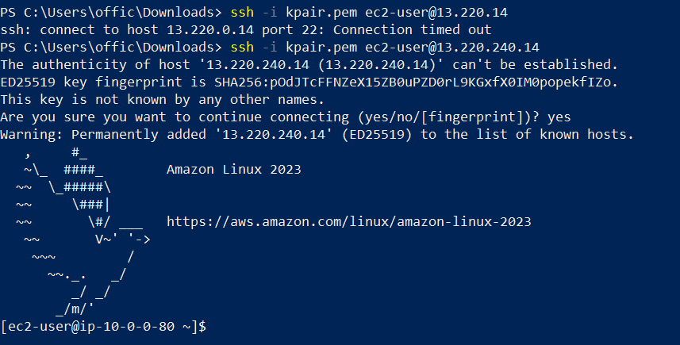

Lets add an elastic ip  on your VPC dashboard:
VPC → Elastic IPs → Allocate Elastic IP

Create NAT Gateway
Go to:
VPC → NAT Gateways → Create NAT Gateway
Fill in:
Name: MyLab-NAT
Subnet: Public-Subnet ⚠️ IMPORTANT
Elastic IP: Select the one you just created
Click Create NAT Gateway

Launching EC2 in the public subnet

