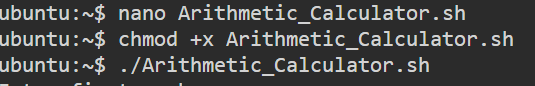

# Bashscript\_Core\_Challenge

## Challenge 1: Basic Arithmetic Calculator

Create a script that takes two numbers as input and performs basic arithmetic operations (addition, subtraction, multiplication, division).

Requirements:

* Prompt user for two numbers
* Perform all four operations
* Display the results
* Handle division by zero

Example output:

Enter first number: 10 Enter second number: 5

Results: 10 + 5 = 15 10 - 5 = 5 10 × 5 = 50 10 ÷ 5 = 2

### Solution:

This Bash script performs basic arithmetic operations on two user-provided numerical inputs. It prompts the user to enter a first and second number, stores these values in variables, and then calculates the sum, difference, product, and quotient.

<figure><figcaption></figcaption></figure>

1. **User Input**
   * The script requests two numbers from the user.
   * Inputs are stored in variables `num1` and `num2`.
2. **Arithmetic Operations**
   * The script calculates:
     * Addition: `sum=$((num1 + num2))`
     * Subtraction: `sub=$((num1 - num2))`
     * Multiplication: `mul=$((num1 * num2))`
     * Division: `div=$((num1 / num2))` (handled safely as described below)
3. **Division Safety Check**
   * Since division by zero would cause an error, the script includes a validation step.
   * It checks whether `num2` equals zero.
   * If `num2` is zero, a warning message _“Cannot divide by zero”_ is displayed.
   * If not, the division operation is performed normally.
4. **Output**
   * The script displays the results of all operations in a clear and readable format, showing each calculation alongside its output.

#### Lessons Learned

This script demonstrates basic Bash arithmetic handling, user input processing, and conditional logic to prevent runtime errors.

Always make sure your file is executable by running chmod.

<figure><figcaption></figcaption></figure>

After running the script, this is the output :&#x20;

<figure><figcaption></figcaption></figure>

#### Lessons Learned

This script is useful for:

* Learning Bash arithmetic operations
* Understanding user input and variable handling
* Practicing conditional logic for error prevention

## Challenge 2: File Operations Script

Create a script that automates directory and file creation.

Requirements:

* Create a directory called bash\_demo
* Navigate into the directory
* Create a file called demo.txt
* Write text to the file (include current date)
* Display the file contents

Example output:

Directory 'bash\_demo' created. File 'demo.txt' created.

File contents: This file was created by a Bash script on 2024-11-29

### Solution

This Bash script automates basic file and directory operations. It creates a directory, navigates into it, creates a text file, writes a message including the current date, and displays the file contents.

The script:

<figure><figcaption></figcaption></figure>

* `mkdir -p` → creates a directory; `-p` ensures no error if the directory already exists.
* `echo` → prints a confirmation message to the terminal.
* `cd` → changes the current working directory to `bash_demo`, so subsequent operations happen inside it.
* `touch` → creates an empty file if it does not exist.
* `echo` → writes text to the file.
* `>` → redirects the output into `demo.txt` (overwrites if file exists).
* `$(date '+%Y-%m-%d')` → inserts the current date in `YYYY-MM-DD` format.

After running the script this is the output:

<figure><figcaption></figcaption></figure>

#### Lessons Learned&#x20;

* Demonstrates basic Bash commands: `mkdir`, `cd`, `touch`, `echo`, `cat`, and command substitution `$(...)`.
* Provides hands-on experience with automating directory and file operations.
* Illustrates how to dynamically include system information like the current date.

## Challenge 3: File Checker with Permissions

Create a script that checks if a file exists and displays its permissions.

Requirements:

* Prompt user for a filename
* Check if the file exists
* If it exists, check if it's readable, writable, and executable
* Display appropriate messages for each permission

Example output:

Enter filename to check: /etc/passwd

File '/etc/passwd' exists. ✓ File is readable ✓ File is writable ✗ File is not executable

### Solution

Here is the script

<figure><figcaption></figcaption></figure>

* `echo` → displays a message asking for input
* `read` → stores the input into the variable `$filename`
* `[ -r "$filename" ]` → checks if the file is readable
* `[ -w "$filename" ]` → checks if the file is writable
* `[ -x "$filename" ]` → checks if the file is executable
*

<figure><figcaption></figcaption></figure>

Above here you can see the script runnning with file that has permissions.

Now let's try a file that does not exist and see the out put&#x20;

<figure><figcaption></figcaption></figure>

I created a file called Linkedin.txt but it's not an executable file, and tried to run it against the script, and here is the output:

<figure><figcaption></figcaption></figure>

### Lessons Learned

* Teaches basic **file testing and permission checks** in Bash
* Demonstrates **conditional logic** with `if-else` statements
* Introduces the use of **user input variables** and safe scripting practices

## Challenge 4: Backup Script for Text Files

Create a script that backs up all .txt files from one directory to another.

Requirements:

* Prompt user for source directory
* Create a backup directory if it doesn't exist
* Copy all .txt files to the backup directory
* Add timestamp to backup directory name
* Display count of files backed up

Example output:

Enter source directory: /home/user/documents

Backup directory created: backup\_2024-11-29\_14-30 Copying .txt files...

Backup complete! Files backed up: 5

### Solution

This Bash script automates the backup of `.txt` files from a user-specified directory. It creates a timestamped backup directory, copies all `.txt` files into it, and displays the number of files successfully backed up. This script demonstrates user input handling, conditional logic, file operations, and dynamic timestamping in Bash.

<figure><figcaption></figcaption></figure>

* `$(date '+%Y-%m-%d_%H-%M')` → creates a timestamp with date and time
* `mkdir -p` → creates the backup directory safely
* `echo` → confirms creation
* `ls -1` → lists files one per line
* `2>/dev/null` → suppresses errors if no `.txt` files exist
* `wc -l` → counts the number of files
* `echo` → displays backup completion message

Below, we can see the output if there are no \*.txt files to back up it will simply show 0 backed up files

<figure><figcaption></figcaption></figure>

And here we can see after creating 3 files in the quantum directory:

<figure><figcaption></figcaption></figure>

#### Lesson Learned

* Teaches Bash file operations, directory management, and wildcards
* Demonstrates dynamic timestamping with date
* Provides hands-on practice with user input, conditional checks, and counting files
* Prepares for real-world scripting tasks like automated backups

&#x20;

## System Monitor Script

Create a script that displays:

Current CPU usage

Memory usage (total, used, free)

Disk usage

Top 5 processes by memory

Save the output to a log file with timestamp

### Solution

This Bash script monitors system resources and outputs a summary of the current system status. It reports **CPU usage**, **memory usage**, **disk usage**, and the **top 5 memory-consuming processes**. The output is saved to a **timestamped log file**, making it easy to track system activity over time.

After debugging and researching, this is the snapshot of the script created:

<figure><figcaption></figcaption></figure>

Key Commands

* cp source/\*.txt target/ → copy .txt files
* ls | wc -l → count files
* mkdir -p → create backup directory
* `exec > "$logfile"` → redirects standard output to the log file
* `2>&1` → redirects errors to the same log file
* `grep "Cpu(s)"` → extracts the line containing CPU stats
* `awk '{print "CPU Usage: " $2 + $4 "%"}'` → sums user and system CPU usage and prints it
* $(date '+...') → timestamp for backup
* `free -h` → shows memory in human-readable format (MB/GB)
* `awk '/^Mem:/ {…}'` → selects the line starting with `Mem:`
* Prints **Total**, **Used**, and **Free** memory

This is the output after running the script:

<figure><figcaption></figcaption></figure>

### Lesson Learned&#x20;

* Provides a **snapshot of system health** for monitoring
* Demonstrates Bash skills, including:
  * **Command substitution** (`$(...)`)
  * **Redirection** (`>`, `2>&1`)
  * **Text processing** with `awk`
  * **Process management** (`ps`, `top`)
* Useful for **administrators**, **DevOps**, and **automation scripts**
