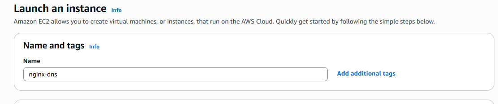

# Objective
Deploy an EC2 instance, install NGINX, expose it via HTTP, and map a custom domain using DNS.
Launched an EC2 instance on Aws 

# SSH into EC2
ssh -i devops-keypair.pem ec2-user@18.226.96.232

# Install NGINX
sudo yum update -y
sudo yum install -y nginx

# Enable and start NGINX
sudo systemctl enable nginx
sudo systemctl start nginx
systemctl status nginx

After running the commands this is the out put you will get :

Jan 23 01:45:19 ip-172-31-1-190.us-east-2.compute.internal systemd[1]: Starting nginx service - The nginx HTTP and reverse proxy server...
Jan 23 01:45:19 ip-172-31-1-190.us-east-2.compute.internal nginx[26639]: nginx: the configuration file /etc/nginx/nginx.conf syntax is ok
Jan 23 01:45:19 ip-172-31-1-190.us-east-2.compute.internal nginx[26639]: nginx: configuration file /etc/nginx/nginx.conf test is successful
Jan 23 01:45:19 ip-172-31-1-190.us-east-2.compute.internal systemd[1]: Started nginx.service - The nginx HTTP and reverse proxy server.

This confirms:

NGINX started successfully
Config file is valid
systemd is managing the service
No errors

Open a browser on your local machine and visit http://your_EC2_ip(172.78.98.10) 
**Welcome to nginx!**

If you see that page — you’re done with the EC2.

