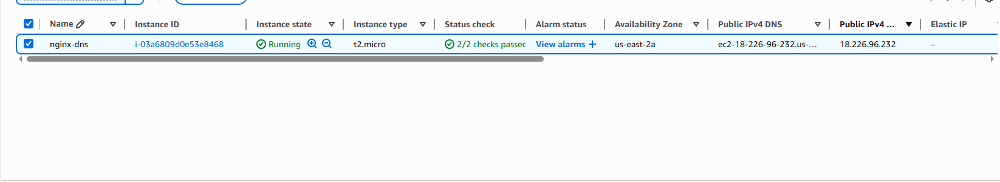
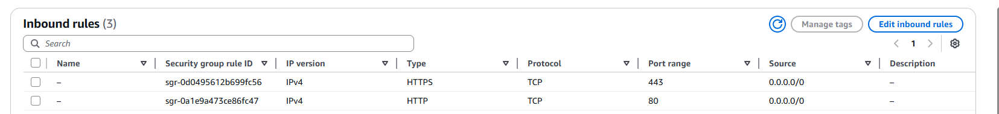
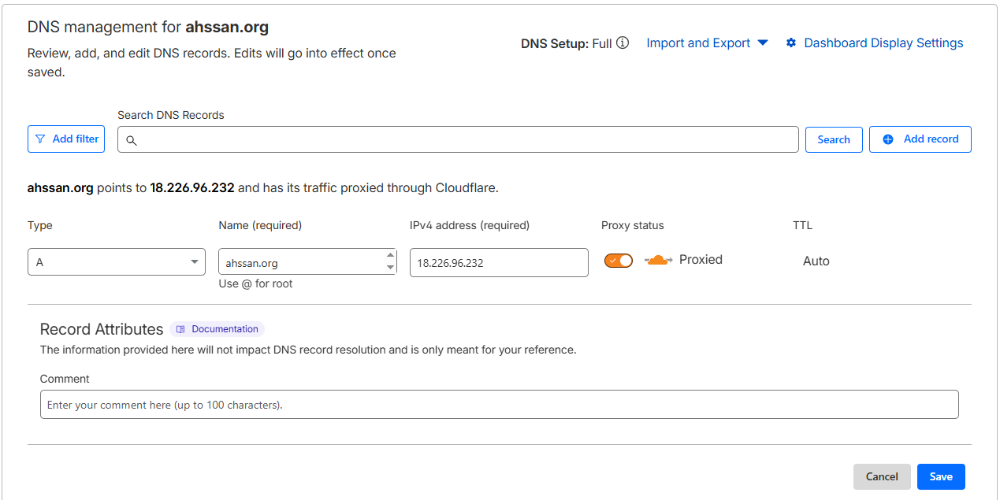
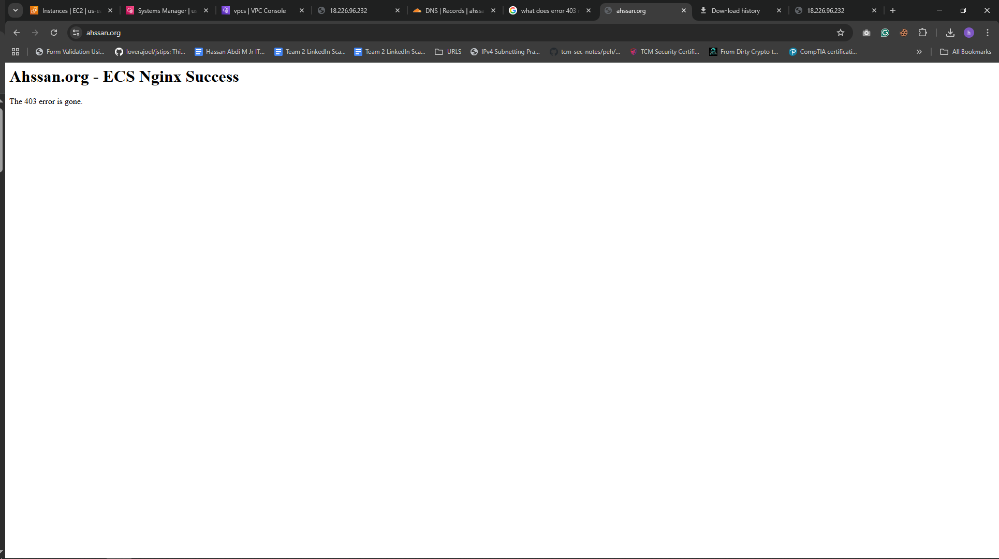

Ec2 + Nginx + Cloudflare Setup Documentation

This document describes the steps taken to successfully connect a Cloudflare-managed domain to an AWS EC2 instance running Nginx.

# #Architecture Overview

Domain Provider: Cloudflare

Web Server: Nginx

Compute: AWS EC2

Protocol: HTTP (Port 80)


# # Objective
Deploy an EC2 instance, install NGINX, expose it via HTTP, and map a custom domain using DNS.
Instance State

EC2 instance is running

Instance has a Public IPv4 address

A public IP is required for internet and Cloudflare access. Without it, the site cannot be reached.
Public ip address on the Instance is 182.226.96.232



An inbound rule created to allow HTTP and HTTPS:



# # SSH into EC2
ssh -i devops-keypair.pem ec2-user@18.226.96.232

# # Install NGINX

```
sudo yum update -y
sudo yum install -y nginx
```

# # Enable and start NGINX

```
sudo systemctl enable nginx
sudo systemctl start nginx
systemctl status nginx
```
After running the commands, this is the output you will get :


```
Jan 23 01:45:19 ip-172-31-1-190.us-east-2.compute.internal systemd[1]: Starting nginx service - The nginx HTTP and reverse proxy server...
Jan 23 01:45:19 ip-172-31-1-190.us-east-2.compute.internal nginx[26639]: nginx: the configuration file /etc/nginx/nginx.conf syntax is ok
Jan 23 01:45:19 ip-172-31-1-190.us-east-2.compute.internal nginx[26639]: nginx: configuration file /etc/nginx/nginx.conf test is successful
Jan 23 01:45:19 ip-172-31-1-190.us-east-2.compute.internal systemd[1]: Started nginx.service - The nginx HTTP and reverse proxy server.
```

This confirms:

NGINX started successfully
Config file is valid
systemd is managing the service
No errors

Open a browser on your local machine and visit http://your_EC2_ip(18.226.96.232) 

**Welcome to nginx!**


If you see that page, EC2 IS up and running.

Configuration file location 

```
server {
listen 80;
server_name ahssan.org www.ahssan.org;


root /var/www/html;
index index.html index.htm;


location / {
try_files $uri $uri/ =404;
}
}
```
This configuration on nginx its a standard Virtual Host configuration that maps public DNS queries for ahssan.org to the local directory /var/www/html, using a fail-safe try_files directive to prevent directory listing and ensure proper 404 error handling.


# # Configure DNS

Log in to Cloudflare and select your domain.

Go to the DNS settings tab and click Add Record.

Fill in the following details:

Type: A

Name: @ (for your main domain) or www (for a subdomain).

IPv4 address: Paste your AWS Public IP.

Click save.




The domain I registered is ahssan.org. Whenever I type ahssan.org into the browser, it's redirected back to the server we launched earlier.

The image shows the domain working :




# # Troubleshooting Performed

Challenge: Unable to access the NGINX page from the browser

Solution: Verified that port 80 was open in the security group and confirmed NGINX was running.


522 / "Site can’t be reached" errors

Root Causes Identified :

    1. Missing or incorrect public IP
    
    2. DNS pointing to the wrong IP

Cloudflare Proxying: Ensure that Cloudflare IPs are allowed in the AWS Security Group to avoid blocking legitimate traffic.

## Lessons Learned

How to provision and manage EC2 instances

The role of security groups in AWS networking

Installing and managing services using systemd

How HTTP traffic flows from the internet to an EC2 instance

    


