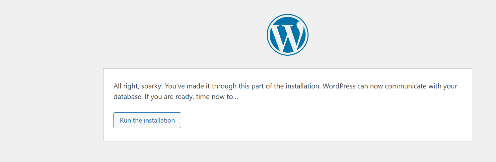
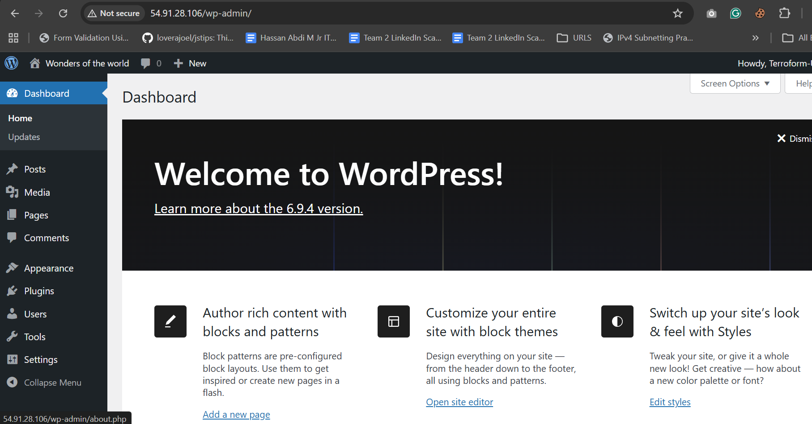

# Terraform + Cloud-Init: WordPress & NGINX on AWS EC2
 
> A complete DevOps learning project — from first error to fully automated infrastructure.
 
---
 
## Table of Contents
 
- [What I Built](#what-i-built)
- [Terraform Code Structure](#terraform-code-structure)
- [What I Learned](#what-i-learned)
- [Issues Hit and How I Fixed Them](#issues-hit-and-how-i-fixed-them)
 
---
 
## What I Built
 
This project covers two end-to-end AWS deployments using **Terraform** as the infrastructure provisioning tool and **cloud-init** as the instance bootstrap mechanism. Both deployments run on Ubuntu 22.04 LTS on AWS EC2 with zero manual configuration steps after `terraform apply`.

### Assignment 1 — WordPress on EC2
 
A fully working WordPress installation provisioned entirely through Terraform, including networking, security, and application setup.
 
| Component | Detail |
|---|---|
| Cloud provider | AWS (us-east-1) |
| Instance | EC2 t3.micro — Ubuntu 22.04 LTS |
| Web server | Apache 2.4 |
| Language runtime | PHP 8.1 with php-mysql, php-mbstring, php-xml |
| Database | MariaDB 10.6 (local, single-instance) |
| Bootstrap method | user_data shell script → migrated to cloud-init YAML |
| Public access | Elastic IP (stable across reboots) |
| Security | Security group: port 80 open, port 22 restricted |
 
### Assignment 2 — Cloud-Init + NGINX
 
A clean demonstration of cloud-init as the preferred bootstrap mechanism, deploying NGINX with a custom HTML page and a `/health` endpoint — fully automated with zero manual steps.
 
| Component | Detail |
|---|---|
| Cloud provider | AWS (us-east-1) |
| Instance | EC2 t3.micro — Ubuntu 22.04 LTS |
| Web server | NGINX |
| Bootstrap method | cloud-init YAML (`#cloud-config`) |
| Public access | Elastic IP |
| Verification | `curl -I http://localhost` returns `200 OK` on boot |
 
### Completion Status
 
| Task | Status | Notes |
|---|---|---|
| EC2 instance provisioned via Terraform | ✅ Done | t3.micro Ubuntu 22.04 |
| Security group with HTTP + SSH | ✅ Done | Ports 80 and 22 |
| WordPress installed and accessible | ✅ Done | `http://<elastic-ip>` |
| Database configured (MariaDB) | ✅ Done | wordpress DB + wpuser |
| cloud-init YAML bootstrap | ✅ Done | Replaces raw bash script |
| NGINX deployed via cloud-init | ✅ Done | With `/health` endpoint |
| Zero manual steps after apply | ✅ Done | Full automation achieved |
 
---
 ### Completion Status
 
| Task | Status | Notes |
|---|---|---|
| EC2 instance provisioned via Terraform | ✅ Done | t3.micro Ubuntu 22.04 |
| Security group with HTTP + SSH | ✅ Done | Ports 80 and 22 |
| WordPress installed and accessible | ✅ Done | `http://<elastic-ip>` |
| Database configured (MariaDB) | ✅ Done | wordpress DB + wpuser |
| cloud-init YAML bootstrap | ✅ Done | Replaces raw bash script |
| NGINX deployed via cloud-init | ✅ Done | With `/health` endpoint |
| Zero manual steps after apply | ✅ Done | Full automation achieved |
 
---

## Terraform Code Structure
 
Both projects follow the same file layout. Keeping each concern in a separate file is a Terraform best practice — it makes the code easier to read, change, and reuse.
 
```
project/
├── main.tf                  # Provider, data sources, security group, EC2, EIP
├── variables.tf             # All input declarations
├── outputs.tf               # Public IP, URL, SSH command
├── cloud-init.yaml          # Bootstrap config — packages, files, runcmd
├── terraform.tfvars         # Your actual values (git-ignored)
├── terraform.tfvars.example # Safe-to-commit values template
└── .gitignore               # Excludes *.tfstate, .terraform/, terraform.tfvars
```
 ### `main.tf` — Key Sections
 
#### Provider block
 
Configures the AWS provider with a region variable and applies default tags to every resource automatically — so every EC2 instance, security group, and EIP is tagged consistently without repeating the tag block.
 
```hcl
provider "aws" {
  region = var.region
 
  default_tags {
    tags = {
      Project   = var.project_name
      ManagedBy = "terraform"
    }
  }
}
```
 
#### AMI data source
 
Instead of hardcoding an AMI ID (which changes per region and goes stale), a data source dynamically looks up the latest Ubuntu 22.04 LTS AMI from Canonical's official AWS account at plan time.
 
```hcl
data "aws_ami" "ubuntu" {
  most_recent = true
  owners      = ["099720109477"] # Canonical's official AWS account
 
  filter {
    name   = "name"
    values = ["ubuntu/images/hvm-ssd/ubuntu-jammy-22.04-amd64-server-*"]
  }
  filter {
    name   = "virtualization-type"
    values = ["hvm"]
  }
  filter {
    name   = "state"
    values = ["available"]
  }
}
```
 
#### Security group
 
Defines ingress rules for ports 80 (HTTP, open to world) and 22 (SSH, restricted to your IP), plus a fully open egress rule. The `cidr_blocks = ["0.0.0.0/0"]` on egress is required — without it the instance cannot reach the internet to download packages.
 
```hcl
resource "aws_security_group" "web" {
  name   = "${var.project_name}-sg"
  vpc_id = data.aws_vpc.default.id
 
  ingress {
    from_port   = 80
    to_port     = 80
    protocol    = "tcp"
    cidr_blocks = ["0.0.0.0/0"]
  }
 
  ingress {
    from_port   = 22
    to_port     = 22
    protocol    = "tcp"
    cidr_blocks = [var.allowed_ssh_ip]
  }
 
  egress {
    from_port   = 0
    to_port     = 0
    protocol    = "-1"
    cidr_blocks = ["0.0.0.0/0"] # Required — without this, no outbound traffic
  }
}
```
 
#### EC2 instance with cloud-init
 
The `user_data` argument accepts the cloud-init YAML file directly. The `#cloud-config` header on line 1 tells cloud-init to parse it as YAML rather than execute it as a shell script. `user_data_replace_on_change = true` ensures Terraform replaces the instance if the bootstrap file is updated.
 
```hcl
resource "aws_instance" "web" {
  ami                         = data.aws_ami.ubuntu.id
  instance_type               = var.instance_type
  key_name                    = var.key_name
  vpc_security_group_ids      = [aws_security_group.web.id]
  associate_public_ip_address = true
 
  user_data                   = file("cloud-init.yaml")
  user_data_replace_on_change = true
}
```
 
### `variables.tf` — Design Decisions
 
Every value that might change between environments is declared as a variable with a description and a sensible default. Sensitive values like `db_password` use `sensitive = true` so Terraform redacts them from plan output.
 
```hcl
variable "db_password" {
  description = "WordPress database password"
  type        = string
  sensitive   = true  # Redacted from terraform plan output
}
```
 
### `outputs.tf` — What Gets Printed After Apply
 
| Output | Value |
|---|---|
| `public_ip` | The Elastic IP address |
| `website_url` | `http://<elastic-ip>` — open this in your browser |
| `ssh_command` | Full SSH command with key path and username |
| `cloudinit_log_command` | Command to tail the bootstrap log after SSH |
 
### `cloud-init.yaml` — Execution Order
 
cloud-init processes sections in a guaranteed order regardless of how they appear in the file:
 
| Section | What it does |
|---|---|
| `package_update: true` | Runs `apt-get update` before any installs |
| `packages:` | Installs all listed packages — waits for apt lock automatically |
| `write_files:` | Creates files on disk before `runcmd` runs |
| `runcmd:` | Runs shell commands in order as root |
| `final_message:` | Writes a completion message to the cloud-init log |
 
```yaml
#cloud-config
 
package_update: true
 
packages:
  - nginx
  - curl
 
write_files:
  - path: /var/www/html/index.html
    owner: www-data:www-data
    content: |
      <h1>It works!</h1>
 
runcmd:
  - systemctl enable --now nginx
 
final_message: "Bootstrap complete after $UPTIME seconds."
```
 
---

## What I Learned
 
### Terraform Concepts
 
- **Infrastructure as Code** means your entire AWS setup lives in text files. You can destroy and recreate identical infrastructure in minutes and review changes before applying them.
- **`terraform plan` is your safety net** — always read the plan before typing `yes`. It shows exactly what will be created, changed, or destroyed.
- **Data sources** (`data "aws_ami"`) let you query AWS for dynamic values at plan time rather than hardcoding IDs that go stale.
- **`user_data_replace_on_change = true`** means Terraform will replace the EC2 instance if your bootstrap script changes — important because it causes downtime.
- **`depends_on`** is sometimes needed to make resource creation ordering explicit, even when Terraform can usually infer it from references.
- **`sensitive = true`** on variables prevents credentials appearing in `terraform plan` output and state file diffs.
 
### cloud-init vs Raw Bash
 
This was the most important lesson of the project. Raw bash scripts in `user_data` fail silently for timing reasons that are hard to debug:
 
- `apt-get` runs before the network is fully ready → repository connection refused
- One failed command silently skips everything after it
- No built-in way to know when the script finished or whether it succeeded
 
cloud-init solves all of these:
 
- The `packages:` block waits for apt to be fully ready automatically
- `write_files:` runs before `runcmd:` — guaranteed ordering
- `final_message:` confirms completion in `/var/log/cloud-init-output.log`
- Each section is isolated — a failure in one section does not silently skip others
 
### AWS Networking
 
- Every security group egress rule needs `cidr_blocks = ["0.0.0.0/0"]` — omitting it blocks all outbound traffic, which prevents the instance downloading any packages at all.
- `security_groups` (EC2-Classic, retired 2022) vs `vpc_security_group_ids` (VPC) — always use `vpc_security_group_ids` with modern AWS accounts.
- An Elastic IP keeps your public address stable across instance reboots and replacements.
- The instance metadata service at `169.254.169.254` is how you get the public IP from inside the instance.
 
### Debugging Skills
 
- Always check `/var/log/cloud-init-output.log` first — it shows every command that ran and exactly where a failure occurred.
- `curl -I http://localhost` from inside the instance tells you immediately whether the web server is responding, eliminating network as a variable.
- `sudo mysql -u root` works without a password on fresh MariaDB installs on Ubuntu — use it to verify and fix database state directly.
- `terraform apply` updates security groups in-place without recreating the EC2 instance — useful for fixing rules without losing a running instance.


## Issues Hit and How I Fixed Them
 
### Issue 1 — Security group `groupId` empty
 
**Error:**
```
Value () for parameter groupId is invalid. The value cannot be empty
```
 
**Root cause:** The EC2 resource used `security_groups` instead of `vpc_security_group_ids`. The `security_groups` argument targets EC2-Classic (retired in 2022) and passes a name string, not an ID. Since no EC2-Classic network exists, AWS returned an empty group ID.
 
**Fix:**
```hcl
# ❌ Wrong
security_groups = [aws_security_group.wordpress_sg.id]
 
# ✅ Correct
vpc_security_group_ids = [aws_security_group.wordpress_sg.id]
```
 
**Lesson:** Always use `vpc_security_group_ids` in any AWS account created after 2013.
 
---
 
 ### Issue 2 — Migrating from bash to cloud-init without destroying the instance
 
**Challenge:** Needed to switch from `user-data.sh` to `cloud-init.yaml` without losing the running WordPress instance.
 
**Root cause:** `user_data_replace_on_change = true` was set, meaning any change to `user_data` would destroy and recreate the EC2 instance.
 
**Fix:** Updated `main.tf` to point to the new file and ran `terraform apply`. Terraform replaced only the EC2 instance while leaving the security group and Elastic IP untouched. The new instance bootstrapped fully automatically in **82 seconds**.
 
```hcl
# Changed from:
user_data = file("user-data.sh")
 
# To:
user_data                   = file("cloud-init.yaml")
user_data_replace_on_change = true
```
 
**Lesson:** `user_data_replace_on_change = true` gives you controlled instance replacement. Terraform shows the replacement in the plan before you confirm — so you always know what will be recreated.
 
---
### Issue 3 — No internet access (missing egress `cidr_blocks`)
 
**Error:**
```
Cannot initiate the connection to us-east-1.ec2.archive.ubuntu.com:80
Network is unreachable
E: Unable to locate package apache2
```
 
**Root cause:** The security group egress rule was missing `cidr_blocks = ["0.0.0.0/0"]`. Without it, AWS blocks all outbound traffic from the instance — it cannot reach the internet at all.
 
**Fix:**
```hcl
egress {
  from_port   = 0
  to_port     = 0
  protocol    = "-1"
  cidr_blocks = ["0.0.0.0/0"]  # ← This line was missing
}
```
 
**Lesson:** An egress rule without `cidr_blocks` silently drops all outbound traffic. Always explicitly include `cidr_blocks` on both ingress and egress rules.
 
---


### Issue 4 — `apt-get upgrade` hanging in user_data
 
**Error:** Bootstrap script stalled — the instance appeared to boot but Apache was never installed.
 
**Root cause:** `apt-get upgrade` in a non-interactive context sometimes prompts for confirmation or waits on locked package manager processes. Without `DEBIAN_FRONTEND=noninteractive`, the upgrade step hung indefinitely.
 
**Fix:**
```bash
# ❌ Wrong — hangs in non-interactive environments
apt-get upgrade -y
 
# ✅ Correct — skip upgrade entirely, just update the index
export DEBIAN_FRONTEND=noninteractive
apt-get update -y
```
 
**Lesson:** Never run `apt-get upgrade` in automated bootstrap scripts. It is slow, can hang, and is not needed on a freshly launched instance. `apt-get update` to refresh the package index is sufficient.
 
---
 


Terraform Init initializes terraform on your project , while Terraform validate checks your configuration as shown above 

As you can see resources are going to be added as this is the planning stage. Terraform plan show what is going to be added to match your desired Infrastructure.

[Terraform apply running](image-5.png)
After terrafoem plan run smoothly we go to the next stage which is terraform aplly where resources are deployed to the cloud. You will get Public Ip of your Ec2 instance and URL
as an output as shown above.


Ec2 up running smoothly on AWS console as shown below.


SSH into your server to check wordpress and Apache running as shown above.


Ater visiting the url you set up wordpress.


Follow instruction to create a wordpress database





*Built as part of a Terraform + AWS DevOps learning series.*
 
